<div align="center">

<h3><code>sakthi@github ~ $ ./contributions.sh</code></h3>



<br><br>

<h3><code>sakthi@github ~ $ whoami</code></h3>

<table>
  <tr>
    <td valign="top"></td>
    <td valign="top"></td>
  </tr>
</table>

<br>

<h3><code>sakthi@github ~ $ ./links.sh</code></h3>

<p><b>Distributed Systems · Backend Engineering · AI Infrastructure</b></p>

<a href="https://sakthivel-portfolio-ecru.vercel.app/">Portfolio</a> ·
<a href="https://linkedin.com/in/sakthivel-p-00152a317/">LinkedIn</a> ·
<a href="mailto:prsakthivel51@gmail.com">Email</a>

</div>

## `$ cat projects.txt`

| Project | What it does |
| --- | --- |
| [Viper](https://github.com/Sakthivel-P-cse/Viper) | Raft-backed distributed key-value store with linearizable reads and WAL recovery |
| [CRDT rate limiter](https://github.com/Sakthivel-P-cse/CRDT-based-decentralized-rate-limiting) | Partition-tolerant Go rate limiter using G-Counters, delta gossip, SWIM, and gRPC |
| [TrustChain](https://github.com/Sakthivel-P-cse/TrustChain-Zero-Trust-Authentication-System-with-Continuous-Trust-Scoring) | Continuous zero-trust authentication with RBAC, ABAC, mTLS, replay protection, and trust scoring |
| CAUSA | Observability-driven Kubernetes root-cause analysis with metrics, logs, traces, and influence graphs |
| AUTOBUILD | Durable agentic software engineering workflows with Temporal, PostgreSQL, LangGraph, GitHub, and gVisor |

## `$ cat focus.txt`

```text
distributed systems  ::  Raft · CRDTs · Gossip · SWIM · gRPC
backend platforms     ::  Go · Python · TypeScript · Java · SQL
agentic infrastructure::  LangGraph · RAG · Temporal · MCP
observability         ::  Prometheus · Loki · Tempo · Kubernetes
storage               ::  PostgreSQL · Redis · Qdrant · FAISS
```

## `$ cat experience.txt`

- AIML Intern at Brakes India
- Software Developer & AI/ML Intern at Allgigi Tech
- BE Computer Science Engineering, Chennai Institute of Technology

## `$ cat certifications.txt`

- Certified Machine Learning Developer — IBM
- Certified Data Analytics — Google
- Generative AI Engineering — IBM

<div align="center">

<sub>Built with Python, SVG, GitHub Actions, and a little terminal nostalgia.</sub>

</div>
